# Supabase 文档上传与文件管理系统（Next.js）

这是一个完整的示例项目，包含：
- 前端：Next.js 页面，支持 PDF 上传、列表展示、在线阅读、下载、删除、AI 摘要。
- 后端：Next.js API Route，负责与 Supabase Storage、Postgres、OpenAI 交互。
- 数据结构：`public.files` 表记录文件元数据。

## 1. 环境要求

- Node.js >= 18
- 一个可用的 Supabase 项目

## 2. 配置 Supabase（必须执行）

1. 登录 [Supabase 控制台](https://supabase.com/dashboard)，创建或选择一个项目。
2. 在 `SQL Editor` 执行 `supabase/migrations/001_init.sql`，创建 `files` 表（包含 `ai_summary` 字段）。
   - 已存在项目可手动执行：`alter table public.files add column if not exists ai_summary text;`
3. 在 `Storage` 中新建一个 bucket（建议名称：`documents`）。
   - 建议设置为 **Private**（私有）。
4. 在 `Project Settings -> API` 中获取：
   - `Project URL`
   - `service_role` key

## 3. 配置环境变量

1. 复制示例环境文件：

```bash
cp .env.example .env.local
```

2. 编辑 `.env.local`（或 `.env`）并填写真实值：

```env
SUPABASE_URL=https://your-project-id.supabase.co
SUPABASE_SERVICE_ROLE_KEY=your-service-role-key
SUPABASE_STORAGE_BUCKET=documents
OPENAI_API_KEY=your-openai-api-key
OPENAI_BASE_URL=https://wolfai.top/v1
OPENAI_MODEL=deepseek-r1
```

## 4. 安装依赖并启动

```bash
npm install
npm run dev
```

启动后访问：
- [http://localhost:3000](http://localhost:3000)

## 5. 功能说明

### 5.1 上传文件（仅 PDF）
- 前端选择文件后调用 `POST /api/files`。
- 后端执行：
  1. 校验文件大小（当前限制 10MB）
  2. 校验文件扩展名/MIME/文件头（仅允许有效 PDF）
  3. 上传到 Supabase Storage
  4. 写入 `public.files` 元数据

### 5.2 文件列表
- 前端调用 `GET /api/files`。
- 后端按 `created_at desc` 返回列表。

### 5.3 在线阅读 PDF
- 前端调用 `GET /api/files/:id/view-url` 获取签名预览链接。
- 页面内通过 `iframe` 直接阅读 PDF。

### 5.4 下载文件
- 前端调用 `GET /api/files/:id/download`。
- 后端根据 `storage_path` 生成 60 秒有效的签名下载链接。

### 5.5 AI 摘要
- 前端调用 `GET /api/files/:id/summary`。
- 后端执行：
  1. 从 Supabase Storage 下载 PDF
  2. 提取 PDF 文本
  3. 调用 OpenAI 生成中文摘要（总览 + 要点 + 结论）
  4. 将摘要写入 `public.files.ai_summary`

### 5.7 编辑摘要（保存到数据库）
- 前端在摘要区域点击“编辑/应用修改”。
- 后端调用 `PATCH /api/files/:id/summary` 更新 `ai_summary`。

### 5.6 删除文件
- 前端调用 `DELETE /api/files/:id`。
- 后端先删 Storage 文件，再删数据库记录。

## 6. 项目结构

```text
app/
  api/files/route.ts                  # GET(列表) + POST(上传，仅PDF)
  api/files/[id]/route.ts             # DELETE(删除)
  api/files/[id]/download/route.ts    # GET(签名下载链接)
  api/files/[id]/view-url/route.ts    # GET(签名预览链接)
  api/files/[id]/summary/route.ts     # GET(AI摘要) + PATCH(保存摘要)
  globals.css                         # 页面样式
  layout.tsx                          # 根布局
  page.tsx                            # 上传和文件管理页面
lib/
  env.ts                              # 环境变量检查
  supabase-admin.ts                   # Supabase 管理端 client
supabase/migrations/
  001_init.sql                        # 初始化 SQL
types/
  pdf-parse.d.ts                      # pdf-parse 类型声明
```

## 7. 常见问题

1. 报错 `Missing required environment variable`
- 检查 `.env.local` 或 `.env` 是否存在并且变量名完全一致。
- 注意 `SUPABASE_URL` 与 `SUPABASE_SERVICE_ROLE_KEY` 必须来自同一个 Supabase 项目。

2. 上传时报 `仅支持上传 PDF 文件`
- 检查文件是否为真实 PDF（不是改后缀伪装）。

3. 上传时报权限错误
- 确认 bucket 名字与 `SUPABASE_STORAGE_BUCKET` 一致。
- 确认使用的是 `service_role` key，不是 `anon` key。

4. 摘要时报 `未配置 OPENAI_API_KEY`
- 在环境变量里补充 `OPENAI_API_KEY` 后重启服务。
- 不需要摘要功能时可以不配置，但 `/api/files/:id/summary` 会返回错误。

5. 摘要模型不生效或报错
- 确认 `OPENAI_BASE_URL` 指向 OpenAI 兼容接口（如 `https://wolfai.top/v1`）。
- 确认 `OPENAI_MODEL` 为 `deepseek-r1`（或平台支持的模型名）。

5. 下载链接打不开
- 签名链接默认 60 秒有效，过期后重新点击下载即可。

## 8. 生产建议（可选）

- 增加用户认证与多租户隔离（例如 `user_id` 字段 + RLS policy）。
- 增加文件类型白名单、病毒扫描、审计日志。
- 将最大上传限制与签名链接有效期做成可配置项。
- 为摘要增加缓存或持久化（避免重复调用模型）。

## 9. 作业提交截图清单（建议按此顺序）

以下截图建议放到仓库中的 `docs/screenshots/` 目录，并在本 README 中按编号引用，便于老师核对。

### 9.1 开发过程截图（Process）

开发过程中的问题与修复记录：
- 问题 1：GitHub 推送时报 `Invalid username or token`。  
  原因：远程地址是 HTTPS，且 GitHub 不支持密码认证。  
  解决：切换为 SSH 远程地址并重新推送。
- 问题 2：本地上传时报 `Load failed` / `The string did not match the expected pattern.`。  
  原因：环境变量配置错误（`SUPABASE_URL` 格式不正确）。  
  解决：修正 `.env` 后重启 `npm run dev`。

SSH 修复命令记录：

```bash
# 1) 启动 agent 并加载私钥
eval "$(ssh-agent -s)"
ssh-add ~/.ssh/id_ed25519

# 2) 复制公钥并添加到 GitHub
cat ~/.ssh/id_ed25519.pub
# GitHub -> Settings -> SSH and GPG keys -> New SSH key

# 3) 测试 SSH 登录
ssh -T git@github.com

# 4) 修改远程地址为 SSH
cd /Users/songxiaowen/File-upload
git remote set-url origin git@github.com:Sylviasong04/File-upload.git
git remote -v

# 5) 提交并推送
git add .
git commit -m "feat: initial project setup"
git push -u origin $(git branch --show-current)
```

01. Git 提交过程截图（第一次）  
- 展示初始化后的首次提交记录。  
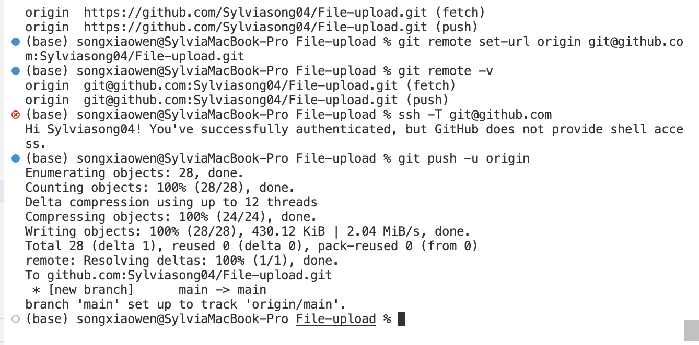

02. Git 提交过程截图（中间迭代）  
- 展示功能开发过程中的提交记录。  
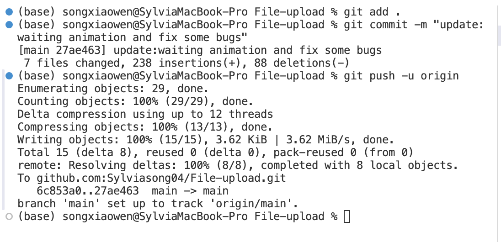

03. GitHub 推送记录截图  
- 展示代码已推送到 GitHub 远程仓库。  
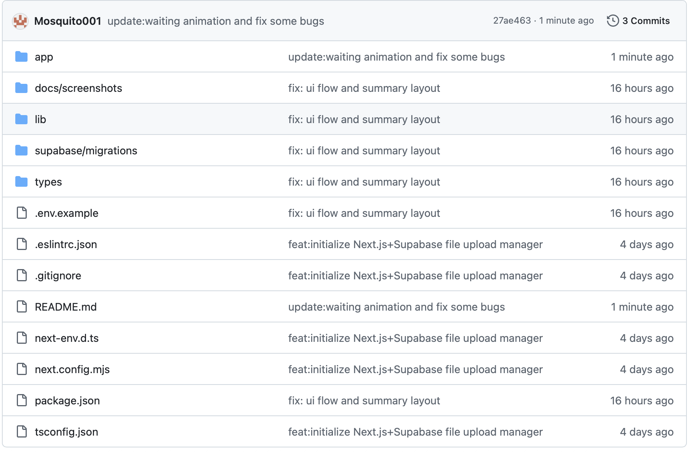

### 9.2 本地测试截图（Local Testing）

04. 本地页面运行截图  
- `npm run dev` 后 `http://localhost:3000` 页面可访问。  
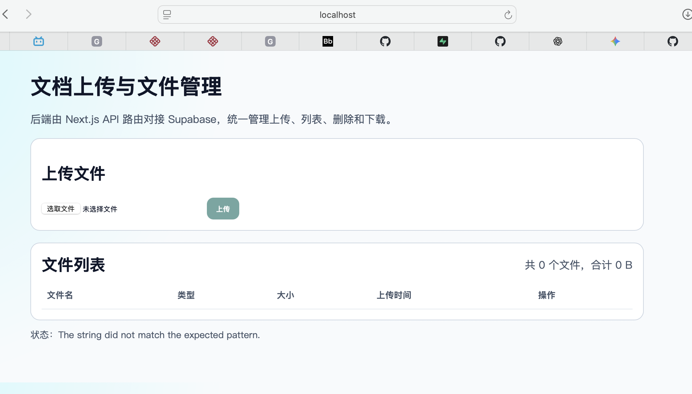

上传失败与修复说明：
- 失败现象：上传时报错。  
- 原因：`.env` 文件配置错误。  
- 修复：修正环境变量后重启服务并重新测试上传。

05. 本地上传成功截图  
- 选择 PDF 并上传成功，页面出现状态提示，列表出现新文件。  
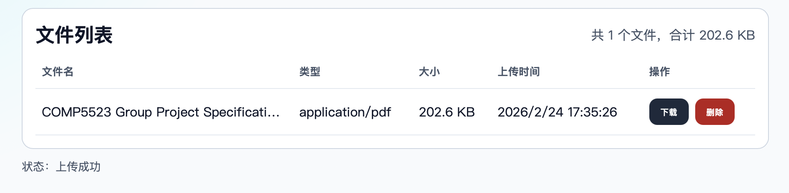

06. 本地阅读功能测试截图  
- 点击“阅读”后页面内出现 PDF 预览。  
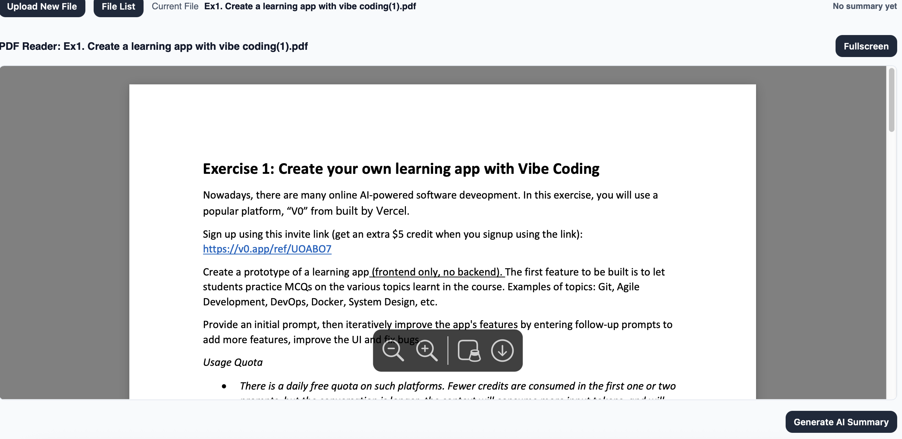

07. 本地 AI 摘要功能测试截图  
- 点击“AI 摘要”后显示中文摘要结果。  
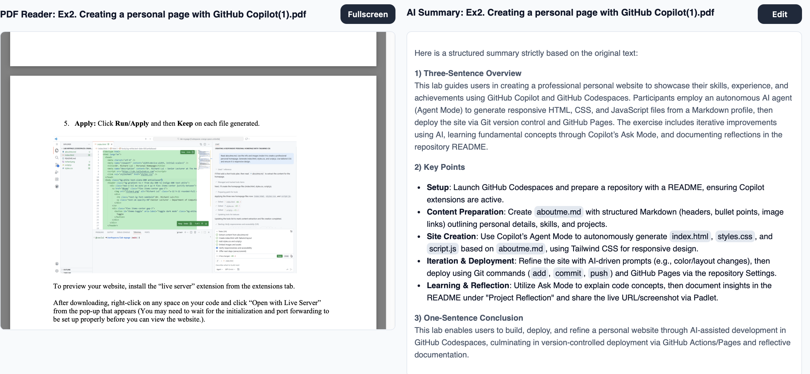

08. 本地下载功能测试截图  
- 点击下载后浏览器可打开/下载文件。  
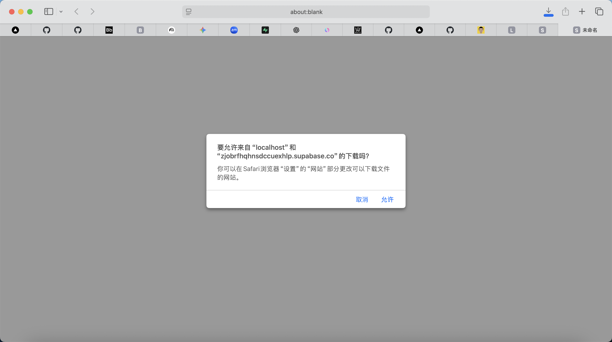

09. 本地删除功能测试截图  
- 删除后列表中文件消失，页面显示“删除成功”。  
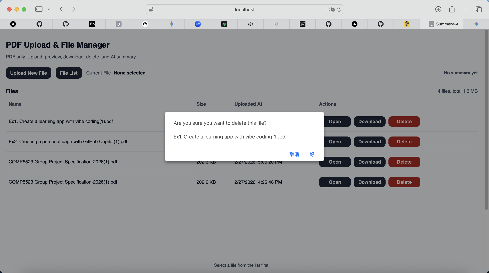

### 9.3 Supabase 对象存储截图（关键要求）

10. Supabase SQL 执行成功截图  
- 在 SQL Editor 执行迁移成功，`files` 表已创建。  
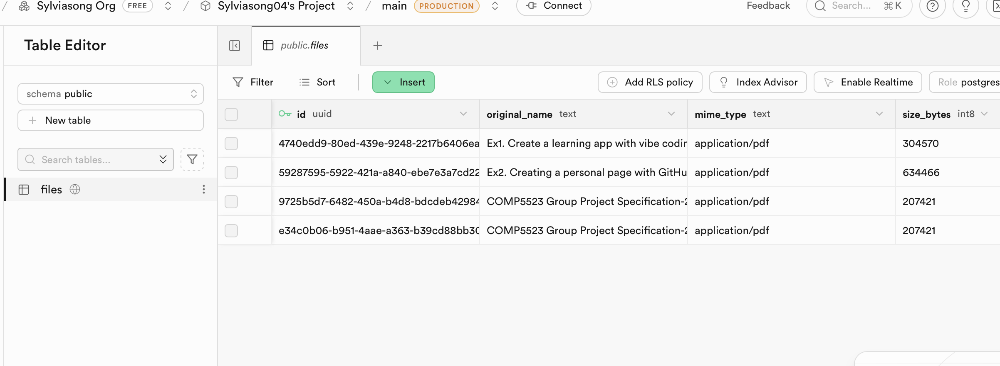

11. Supabase Storage Bucket 截图  
- Storage 页面能看到 bucket（例如 `documents`）。  
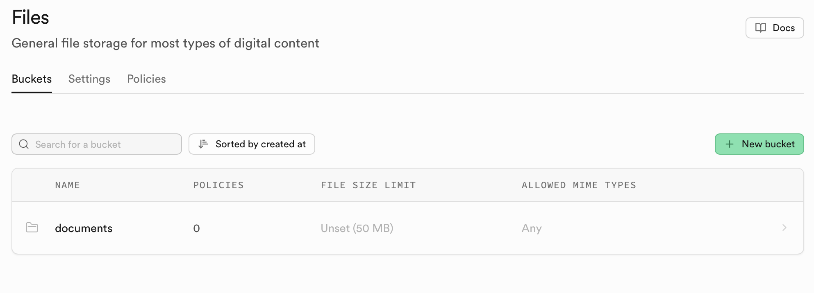

12. Supabase Storage 文件截图（必须）  
- bucket 内能看到上传后的 PDF 文档对象。  
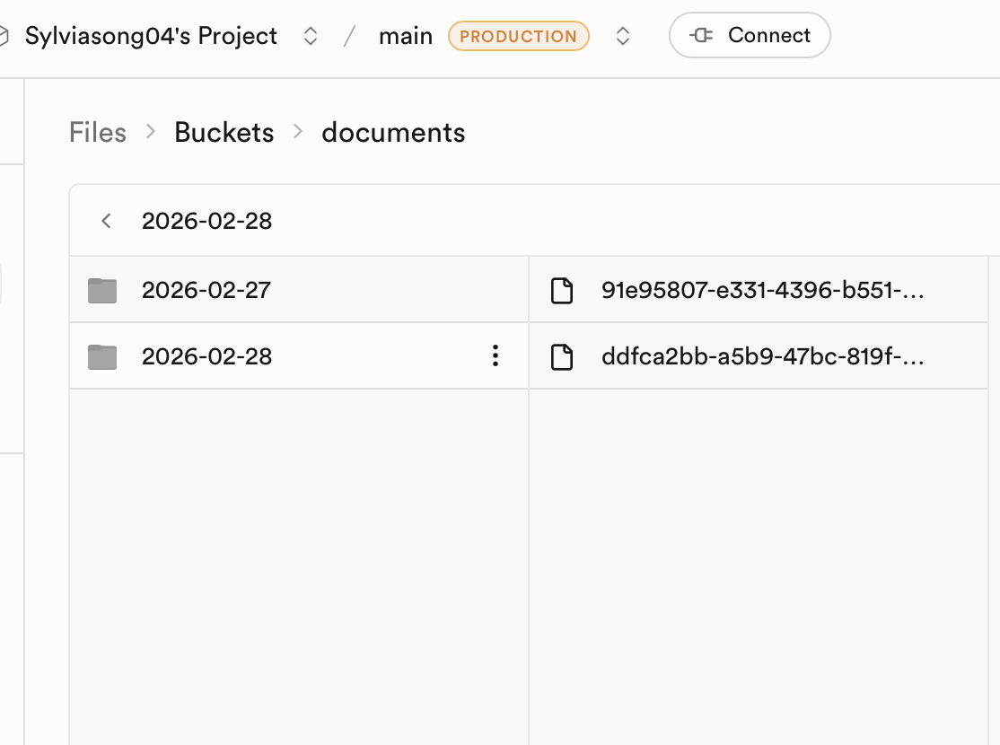

13. Supabase 数据表记录截图  
- `Table Editor -> files` 中能看到对应元数据记录。  


### 9.4 Vercel 部署与线上验证截图（Deployment）

14. Vercel 部署成功截图  
- Vercel Dashboard 显示 `Ready` / `Production`。  


15. 线上功能验证截图（可拼图或多图）  
- 至少包含线上上传（PDF）、阅读、AI 摘要、下载、删除成功的证据。  


## 10. README 中建议附加的测试结论模板

可在提交前补充如下简短结论（示例）：

- 本地环境（日期：YYYY-MM-DD）已验证上传（仅 PDF）、列表、阅读、AI 摘要、下载、删除均正常。  
- Supabase Storage 与 `public.files` 表数据一致。  
- Vercel 生产环境（日期：YYYY-MM-DD）已验证同样功能均正常。  
- 已按开发过程进行多次提交并推送到 GitHub。
